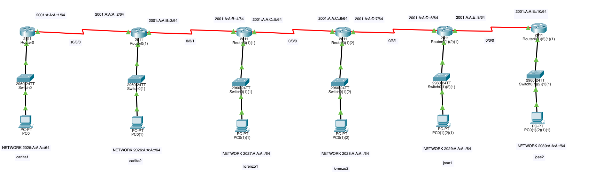
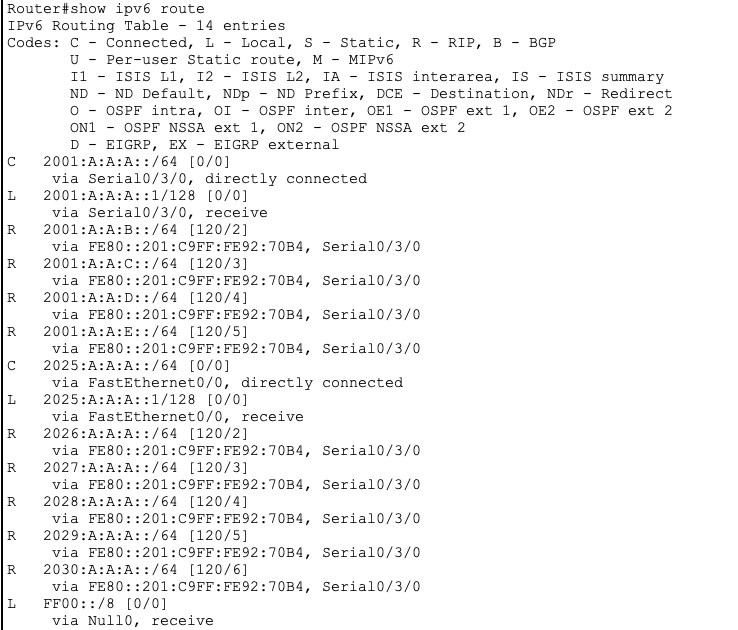
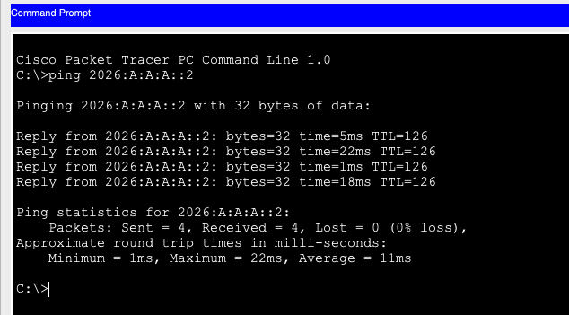
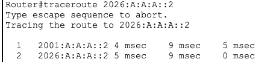

# Enrutamiento IPv6 por alias

## Descripción
En este proyecto se ha diseñado y configurado una red con varios routers utilizando direcciones IPv6 en Cisco Packet Tracer.

Se ha habilitado el enrutamiento IPv6 en los routers y se han configurado rutas entre redes utilizando enrutamiento IPv6 por alias, empleando direcciones link-local como siguiente salto entre routers.

El objetivo es permitir la comunicación entre diferentes redes IPv6 a través de varios routers.

## Topología de red
La red está formada por varios routers conectados mediante enlaces serial y diferentes redes LAN IPv6 conectadas a cada router.

## Direccionamiento IPv6
Se han utilizado diferentes prefijos IPv6 para las redes LAN y los enlaces entre routers, por ejemplo:

- 2001:A:A:A::/64
- 2001:A:A:B::/64
- 2001:A:A:C::/64
- 2001:A:A:D::/64
- 2001:A:A:E::/64
- 2025:A:A:A::/64
- 2026:A:A:A::/64
- 2027:A:A:A::/64
- 2028:A:A:A::/64
- 2030:A:A:A::/64

## Enrutamiento IPv6 por alias
En este proyecto se ha utilizado enrutamiento IPv6 por alias, utilizando direcciones link-local (FE80::) como siguiente salto entre routers.

En la tabla de rutas IPv6 se puede observar que las rutas se aprenden a través de direcciones link-local de los routers vecinos:
via FE80::201:C9FF:FE92:70B4, Serial0/3/0

Esto significa que los routers utilizan direcciones IPv6 link-local para comunicarse entre ellos y reenviar el tráfico hacia las diferentes redes IPv6.

## Tabla de routing IPv6
Se ha comprobado la tabla de rutas IPv6 con el comando:
show ipv6 route

En la tabla de rutas se pueden observar:
- Rutas conectadas (C)
- Rutas locales (L)
- Rutas aprendidas mediante routing (R)

## Pruebas de conectividad
Se ha comprobado la conectividad entre redes IPv6 mediante el comando ping:
ping 2026:A:A:A::2

Esto verifica que existe conectividad entre diferentes redes IPv6 a través de los routers.

También se pueden comprobar los saltos entre routers mediante:
traceroute 2026:A:A:A::2

## Comandos utilizados
Algunos comandos utilizados en los routers:
ipv6 unicast-routing
show ipv6 route
show ipv6 interface brief
show ipv6 neighbors

## Tecnologías utilizadas
- Cisco Packet Tracer
- IPv6
- Routing
- Redes LAN/WAN
- Enrutamiento IPv6 por alias

## Objetivos del proyecto
- Configurar direcciones IPv6
- Habilitar enrutamiento IPv6
- Configurar enrutamiento IPv6 por alias
- Establecer conectividad entre redes
- Comprobar la tabla de rutas
- Verificar conectividad mediante ping y traceroute
